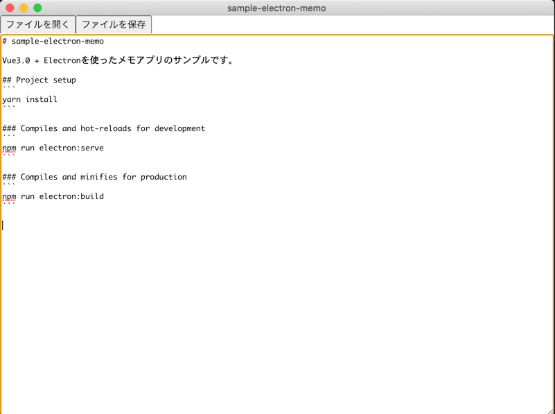

# sample-electron-memo

Vue3.0 + Electronを使ったメモアプリのサンプルです。

## Project setup
```
yarn install
```

### Compiles and hot-reloads for development
```
npm run electron:serve
```

### Compiles and minifies for production
```
npm run electron:build
```

### Screenshot
